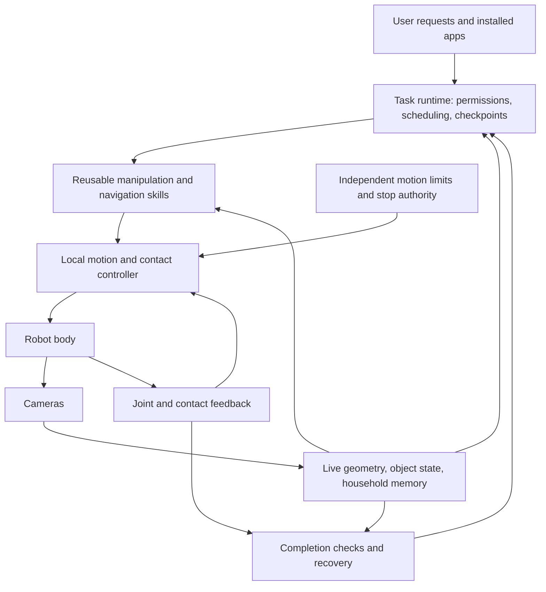

# A programmable personal robot: initial engineering thesis

Date: September 22, 2026. This is a proposed architecture and validation plan, not a validated product specification. Web evidence was researched through Aside MCP; primary sources and their limits are recorded below. Numeric development gates below are proposed learning targets, not demonstrated performance or consumer release criteria.

The opportunity is an extensible household manipulation platform: a robot that learns where things belong, completes useful physical jobs, and gains abilities through software and tools. The first product needs a bounded operating envelope and a compelling everyday job. A universal promise spanning every home, object, and chore would hide the engineering decisions that determine whether the product works.

User direction: prioritize optical sensing; touch is also acceptable. Proposed baseline: cameras provide environmental perception and metric 3D reconstruction without lidar; optical encoders measure joint position; tactile sensing supplies contact information. The initial concept does not assume permission to add non-optical inertial sensing or use motor-current measurements as policy inputs. Motor electronics still need normal electrical and thermal protection.

## Proposed first product

A compact wheeled robot with a lifting torso, a design that accommodates two arms, cameras on the head and wrists, and replaceable grippers/tools. Start with one accessible floor. Evaluate a second arm against the actual task portfolio; its value is particularly strong when one hand must stabilize an object while the other manipulates it.

The first job should be a **nightly room reset**: return a declared set of familiar, graspable objects to accessible locations or open bins. This exercises finding, navigation, reaching, grasping, transport, placement, memory, and recovery in one repeated activity. Start with approved rigid objects. Add clothes, cables, fragile objects, closed containers, and liquids as distinct capabilities after testing their failure modes.

The product-level success measure is net household time saved. Every minute spent preparing the room, helping the robot, correcting its work, and maintaining it reduces that benefit. A robot can perform a chore more slowly than a person and still create value if the person can leave it alone.

Your existing `household_task_inventory.md` is useful for identifying candidate chores, but its difficulty ratings explicitly assume human teleoperation. They do not establish autonomous readiness. The existing Connector Robot folder describes a concept, not an implemented runtime.

## Embodiment and dexterity

| Decision | Initial proposal | What settles it |
| --- | --- | --- |
| Locomotion | Wheels, low center of mass, automatic docking | Doorways, rugs, thresholds, turning space, noise, and power measurements in target homes |
| Vertical reach | A lift that supports floor pickup and countertop access | A measured reach-and-load map, including cabinet and furniture obstructions |
| Arms | Prototype with existing hardware; compare single-arm and bimanual completion | Tasks requiring stabilization, opening, pulling, carrying, and tool use |
| Hands | Compliant two-finger/adaptive grippers, replaceable fingertips, standardized tool attachment | Matched-budget comparisons against richer hands on the same object/task distribution |
| Perception | Calibrated stereo/multiple RGB cameras; head, wrist, and low-level coverage | Depth and tracking performance on clutter, textureless surfaces, glare, occlusion, dim light, and moving people |
| Contact | Optical joint sensing, compliant mechanics, tactile feedback; evaluate optical tactile fingertips | Slippage, jams, fragile objects, hidden contact, and force regulation |
| Compute | Local control, stop authority, and essential navigation; optional remote planning/training | Measured latency, thermal load, disconnected operation, and task performance |

Do not freeze dimensions or payload from a concept sketch. Derive them from the task set. Payload must be specified at reach and in a particular posture; a nominal arm rating alone does not establish whole-robot stability. Carry heavier loads on a chassis tray where possible. Include pinch points, power loss, thermal limits, maintainability, and replacement of worn contact surfaces in mechanical design.

Dexterity is a system property: arm placement, wrist orientation, fingertip geometry, compliance, sensing, control, and tools all matter. Five fingers are an option to test. Tool use can increase task coverage more economically than adding finger joints. A second arm can be more valuable than a more intricate hand for some chores; only task-level measurements settle that tradeoff.

Stairs introduce another locomotion requirement; legs, climbing bases, and environmental access are options to evaluate. A wheeled first product makes a deliberate coverage tradeoff. It does not solve every part of a multistory home.

## What “all camera” should mean

Camera-based scene understanding is a defensible architecture hypothesis. A fixed stereo baseline can provide metric depth; multiple views support mapping and active inspection. A single moving camera has additional scale and observability issues. The camera configuration must be tested on the difficult materials and lighting found in real homes.

The user initially chose strictly optical sensing, then explicitly allowed touch. External images do not directly reveal every contact condition. During a grasp, the useful surface may be hidden by a finger; an object can begin slipping before distant cameras provide a useful signal. A camera-centric robot should still observe its body and contact state. Optical tactile sensors are one way to use cameras at the contact surface. They retain the engineering burden of durable fingertips, calibration, and fast interpretation.

A literal camera-only variant remains an optional comparison, rather than the chosen baseline after allowing touch. Optical observation of compliant elements can estimate deformation and force, but imposing this constraint throughout the machine could increase complexity. It should earn its place through measured cost, reliability, and performance.

Fingertip touch and optical position encoders do not reveal every joint load or elbow/chassis collision. Whole-body contact limits require a validated sensing and mechanical design: candidates include distributed touch, optical measurement of elastic deflection, compliance, and mechanical limits. Do not claim software can enforce a force bound that the hardware cannot reliably observe or physically constrain.

Without a non-optical IMU, base motion and attitude estimation need explicit testing. Evaluate stereo visual odometry, optical wheel encoders, and contact observations under wheel slip, blocked cameras, dim light, external disturbance, and being lifted. Stop when localization or stability confidence leaves the tested envelope. Existing research platforms may include additional internal sensors; document those dependencies before treating their results as validation of this sensing architecture.

## Persistent 3D understanding

Interpret “always having 3D” as maintaining an up-to-date estimate of the home. It cannot mean knowing unobserved changes with certainty. An object moved behind a closed door should produce uncertainty, not an invented position.

Maintain three connected representations:

1. **Metric geometry:** traversable space, obstacles, surfaces, collision geometry, and the robot's estimated pose.
2. **Object and interaction state:** object identities, positions, articulated doors/drawers, possible grasp surfaces, containment, and estimated contact properties.
3. **Household memory:** ownership, where objects belong, user preferences, room permissions, and what was observed when.

Every actionable belief needs a timestamp and an uncertainty estimate. Reobserve a destination before placing an object there. Recheck a path as people move through it. Keep local collision geometry fresh even when the longer-term map changes slowly. Separate directly observed facts from model inferences.

A detailed reconstruction or attractive rendering is not by itself evidence of manipulation accuracy. Test calibration drift, relocalization after the robot is moved, thin obstacles, reflective/transparent materials, articulated objects, and changed room layouts.

Local scene processing and persistent memory do not require indefinite retention of raw video. Define retention, deletion, household access, and any remote viewing explicitly.

## Software architecture

Use a language/reasoning model to interpret requests, clarify ambiguity, decompose chores, and select skills. Use robot policies and geometric/control methods to perform physical actions. Keep essential control and stop behavior local and bounded independently of a cloud model or application.

The runtime should replan from observations, detect lack of progress, retry within limits, request help when necessary, and verify the intended result. Reaching the end of a policy trajectory is not a sufficient success test.

Separate knowledge from motor learning. Showing the robot where a mug belongs may be a simple memory update. Teaching it to open an unfamiliar clasp may require demonstrations, a new manipulation policy, and evaluation. Neither a fluent explanation nor a plausible generated plan establishes physical competence.

Use existing models and research hardware to investigate feasibility before training a foundation model or designing custom actuators. Record synchronized observations, actions, robot state, outcomes, failures, and corrective interventions. Evaluate on homes, objects, layouts, and task combinations withheld from development. Simulation and replay are useful development tools; real contact and complete closed-loop chores still require physical evaluation.

## Why this remains difficult

Software, hardware, data, and economics are coupled:

- **Long tasks accumulate failures.** As an illustrative independent-step calculation, 100 required actions with 99% success each yield approximately 36.6% complete-task success without recovery. At 99.9% each, the result is approximately 90.5%. Real failures are often correlated; this is an intuition, not a robot benchmark.
- **Homes vary in mechanically important ways.** Drawer resistance, slippery packaging, clutter, soft objects, changing illumination, and the meaning of “put away” alter what a correct action entails.
- **Contact exposes hidden state.** Friction, mass, compliance, and constraints may become apparent only while interacting. The robot must adapt during contact.
- **Data acquisition has a physical cost.** Demonstrations need hardware, resets, coverage, and quality control. Failure and recovery examples matter alongside successful trajectories.
- **A useful body must balance conflicting requirements.** Reach, strength, softness, size, noise, endurance, durability, serviceability, and cost pull the design in different directions.
- **Consumer usefulness includes operations.** Installation, cleaning, repairs, support, remote assistance, and household tolerance determine whether the product creates value.

My working assessment: integrated autonomy and reliable recovery are the largest uncertainty for a useful household prototype. Affordable, durable, serviceable hardware and support become equally consequential for a consumer product. This is a design judgment, not a quantified industry result.

The current evidence does not justify saying robots cannot generalize to new homes. [PI's π0.5](https://www.pi.website/blog/pi05) explicitly evaluates new homes. The [π0.7 paper](https://www.pi.website/download/pi07.pdf), section X, reports a gap between seen-task performance and unseen tasks or task–robot combinations; its multistep instruction evaluation scores individual instructions. The remaining product question is complete, unattended work across the declared home/task distribution, including recovery. It is also inappropriate to infer that no company has delivered a home manipulator merely because the reviewed public sources do not verify deliveries.

## A physical App Store

Start with one supported hardware configuration. Build developer interfaces early, then open broad distribution after the core actions are dependable. Portability across radically different bodies should be a later tested capability.

Ordinary apps compose platform capabilities such as `find`, `inspect`, `navigate`, `pick`, `place`, and `verify`. New low-level learned motor policies use a separate evaluated release path. The platform retains control of actuators and enforces resource limits.

Each skill package declares:

- Compatible robot, gripper, tools, objects, and environmental conditions.
- Permissions for rooms, objects, external services, video retention, and remote assistance.
- Preconditions, including freshness and confidence of observations.
- Bounds on force, speed, payload, execution time, and retries.
- Observable completion criteria and the evidence used to check them.
- Recovery, refusal, interruption, and safe resting behavior.
- Versioned model/runtime dependencies and regression results.

For example, an “evening toy reset” app moves approved objects from a defined floor area into designated open bins. It reports items it could not identify or handle. The runtime prevents two apps from simultaneously commanding the same arm and invalidates observations when another action changes the scene.

Provide a nontechnical authoring path: choose objects and destinations, show preferences, demonstrate when needed, preview the workflow, and run a supervised trial. Apps can combine physical actions with authorized digital integrations, but external text or imagery must not grant new privileges.

Digital state can often be restored after a software crash. Physical consequences may persist. Cancellation must therefore specify what happens to a held object, applied force, and occupied space. Signed packages, sandboxing, and a language-model prompt alone do not establish safe physical behavior.

## Meaningful “superhuman” targets

Choose properties that can be measured: remembering more object locations with evidence and timestamps; noticing changes across a room; inspecting from several camera viewpoints; repeating a calibrated action precisely; scheduling work across longer periods with charging breaks. These are target advantages, not claims about the proposed robot.

High strength and speed raise power, thermal, stability, and contact-control demands. They should be set by useful tasks. Reliable handling of ordinary household objects is a more valuable early milestone than an impressive maximum force specification.

## A proposed 90-day validation program

This schedule assumes access to a suitable platform and team. It is an experiment plan, not a commitment to ship a consumer robot in 90 days.

| Period | Work | Decision evidence |
| --- | --- | --- |
| Days 1–14 | Observe approximately 10 homes; define one recurring chore, object distribution, current manual time, and tolerated setup | A frequent problem, meaningful net time savings, and a written operating envelope |
| Days 15–35 | Perform the chore with existing hardware and explicit teleoperation; compare grippers/arms where needed | Mechanical feasibility, reach/load coverage, and a classified failure log |
| Days 36–65 | Automate the full loop, including unsuccessful grasps, changed object positions, placement checks, and recovery | A proposed internal target of more than 95% fully autonomous complete chores divided by all eligible attempted chores in the declared benign scope |
| Days 66–90 | Run monitored tests in unseen homes; have an independent developer build a second workflow using the same capabilities | Useful time saved, manageable intervention/maintenance burden, and real reuse of the platform |

For that internal target, human assistance or skipped in-scope objects prevent an attempt from counting as autonomous success. Measure correct refusal of out-of-scope requests separately. The target is not a consumer safety threshold. Report sample size and uncertainty. A small pilot cannot establish rare-event safety. Record damage and near misses throughout, and increase exposure before making broader claims.

Track at least complete-chore success, skipped objects, autonomous completion, assisted completion, recovery success, human minutes per robot hour, household setup/rescue time, task duration, downtime, and total cost per completed chore. Keep operator assistance and staged preparation visible. Ten percent assistance time does not automatically imply that one person can support ten robots; simultaneous requests and response deadlines matter.

The immediate engineering decision is the first complete chore and its evaluation environment. Hardware choices, model selection, data collection, and SDK primitives should follow from that decision.

## Primary evidence and limits

The following sources were examined through Aside MCP. Research demonstrations and manufacturer statements have different evidentiary weight; neither alone establishes independent consumer reliability.

| Source | Relevant evidence | Limit on the conclusion |
| --- | --- | --- |
| [Mobile ALOHA](https://arxiv.org/html/2401.02117) | Bimanual mobile manipulation using simple parallel grippers, RGB camera observations, and joint positions; selected tasks were learned with task-specific demonstrations and static co-training | Separate task policies and controlled evaluations do not establish arbitrary-home generality. A camera-based policy does not imply the underlying hardware lacks other internal sensors. |
| [TidyBot++](https://arxiv.org/html/2412.10447v1) | A compact single-arm mobile manipulation platform with a parallel gripper; a narrow countertop-wiping experiment favored holonomic mobility | The experiment does not settle the best production base across carpets, thresholds, energy use, and cost. |
| [TidyBot++ bill of materials](https://tidybot2.github.io/docs/bom/) | The roughly $5,400 standard-base figure excludes the arm and the rest of the complete robot | Do not use the base price as a consumer-robot cost estimate. |
| [AnySkin](https://any-skin.github.io/) | Adding tactile input improved selected contact-rich tabletop tasks compared with camera-only input | This is magnetic tactile sensing, not optical; the study does not prove home-wide reliability. |
| [DIGIT](https://arxiv.org/abs/2005.14679) | An internal camera observes deformation in a tactile fingertip | Optical touch is feasible; this does not eliminate fingertip wear, calibration, or manipulation-learning problems. |
| [Matic engineering post, August 25, 2026](https://maticrobots.com/blog/twice-the-intelligence-still-nothing-leaves-your-home) | The company describes navigation using five RGB cameras without lidar or a separate depth sensor | This supports camera-based perception in a bounded floor-cleaning product. It does not establish camera-only whole-body sensing or household manipulation. Deployment numbers and performance claims are manufacturer reports. |
| [1X NEO product page](https://www.1x.tech/neo), [order page](https://www.1x.tech/order), and [factory update](https://www.1x.tech/discover/neo-factory) | The company advertises foundational autonomy, scheduled human Expert assistance, and a 2026 delivery window; its April factory update says early units prioritize internal use | These pages do not verify the extent of completed customer deliveries or independently establish unattended capability. Lack of a delivery announcement is not proof that no customer has received a robot. |
| [1X hand design, July 9, 2026](https://www.1x.tech/discover/neos-hands) | The company describes tactile sensing of contact location, normal force, and shear, and explains visual limitations during manipulation | A manufacturer design statement is not a comparative evaluation of all sensor configurations. |
| [Hello Robot developer platform](https://hello-robot.com/develop/) and [Stretch 4 datasheet](https://hello-robot.com/wp-content/uploads/2026/05/HelloRobot-DataSheet-Stretch-4-Rev5_AsLaunched.pdf) | An open developer platform with Python/ROS2 interfaces; Stretch 4 includes lidar and inertial sensing and is scoped to research/development | A useful software/hardware precedent, but not validation of the proposed optical/touch sensor restriction or a consumer appliance. |
| [Dobb-E](https://arxiv.org/abs/2311.16098) and [project](https://dobb-e.com/) | The authors report 81% success over 109 evaluated tasks in 10 homes with task-specific demonstrations and adaptation | This demonstrates real-home learning, not arbitrary new chores without adaptation. Its data collection includes depth, so its results do not directly validate an RGB-only pipeline. |
| [ORB-SLAM3](https://arxiv.org/abs/2007.11898) | Supports visual and visual-inertial mapping; the paper identifies low-texture environments as an important failure mode | Algorithm availability does not guarantee robust localization in every home; the chosen camera-only configuration needs its own evaluation. |
| [ConceptGraphs](https://arxiv.org/abs/2309.16650) | Builds open-vocabulary 3D scene graphs; reported limitations include missed small/thin objects and duplicate detections | Semantic 3D memory is feasible, but this implementation is not evidence of complete, always-correct home state. Its robot demonstration uses RGB-D. |
| [π0.5, April 22, 2025](https://www.pi.website/blog/pi05) | Evaluates manipulation and household tasks in homes excluded from training | Demonstrates new-home generalization; does not establish arbitrary unattended chores at consumer reliability. |
| [π0.7 paper](https://www.pi.website/download/pi07.pdf) and [April 16, 2026 post](https://www.pi.website/blog/pi07) | Authors describe seen-task success commonly above 90%, versus 60–80% for unseen tasks or task–robot combinations. Instruction evaluation includes 14 scenarios in four unseen kitchens and two unseen bedrooms | The numbers are author evaluations with specific protocols. Instruction success is not the same as complete-chore success. The paper's human comparison uses teleoperators encountering the tested robot embodiment for the first time. |
| [π*0.6 paper](https://www.pi.website/download/pistar06.pdf) | Combines demonstrations, corrective interventions, and autonomous experience; identifies reward labeling, interventions, and resets as dependencies | Improved policy performance still depends on a physical data-collection and evaluation operation. |
| [Gemini Robotics 2](https://deepmind.google/blog/gemini-robotics-2-brings-whole-body-intelligence-to-robots/) | Reports whole-body and dexterous manipulation evaluations, with substantial variation between individual tasks | The public post does not provide trial counts/full protocols for all displayed task percentages. Do not infer a broad household success rate or a causal diagnosis of failures from those charts. |
| [BEHAVIOR challenge](https://behavior.stanford.edu/challenge/index.html) and [evaluation](https://behavior.stanford.edu/challenge/evaluation.html) | Distinguishes partial progress from complete success on full-length household activities | A benchmark is an evaluation tool, not direct proof of physical consumer deployment. Do not treat an incomplete, unverified challenge leaderboard as a limit on the entire field. |
| [Forces for Free](https://www.science.org/doi/10.1126/scirobotics.adq5046) | Estimates force by visually observing a specifically designed compliant hand | Supports an optical-force design option; does not establish force observability from arbitrary external camera images. |
